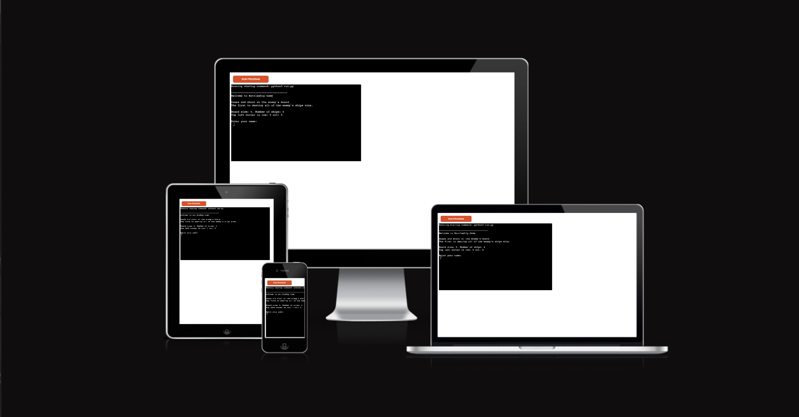

# The BattleShip Game

The Battleship Game is a game that's played in the terminal against the computer.
The rules of this game is simple, you should guess were the opponets(computer's) ships are located and destroy them. Valid guesses are integers from 0 - 4, 0,0 is top left. This game has four ships that you need to destroy to win the battle.
When you hit a ship, you will see "@" on the board and "Hit", if you miss you will see "X" and "Miss.

The game is live here, Enjoy the game!: [BattleShipGame](https://fredricho.github.)

## Features

## Existing Features

  * ### Randomly generated boards.
    * Randomly adds ships to the board, so they will be located at diffrent places after each battle.

  * ### Play against the computer
    * The player plays against the computer
    * The user can input their name
    * Handles given coordinates from the player.
     
   * ### Validates input
     * Validates all inputs from player, the name has to be just letters from the alphabet. 
    Valid coordinates are integers from 0 -4. You can't guess at the same coordinate twice.
    The data is stored in the board class.

 

## Future Features
* Let the user place out their own ships.
* Let the player decide the board size and number of ships
* Let the user enter a key to restart/rematch the game.

## Technologies Used
* Python - Provides all of the code that runs the game.
* Heroku - Used to deploy the site. 
* Github - Used to host the site and make edits. 

## Testing 

### Code Validation

The game has gone through CI Python Linter Code validator and has been manually tested by me for many hours and also by peers, no errors were reported. The CI Linter Code found several minor errors such as whitespaces, unexpected amount of blanklines too long lines etc. All of the errors were fixed, beside the too long lines, the longest one were a comment of the code and the other were printing messages for the player. Images of the result below(You cannot see all of the errors, there were a few more.)

 * Manual test:
  * Only letter for username: CHECK
  * Only integers in range for coordinates (0 - 4): CHECK
  * Rematch after the battle is over (YES,NO,no,NO) as valid answers: CHECK
  * The game ends after the player or computer has found all ships : CHECK

* ### CI Python Linter Code

 ## Known Bugs
 * Resolved
   * The game failed to annouance the right winner, it annouanced the looser as winner.
    * The game crashed after ship number four were found, so you were unable to see that the last shot really was a hit.
    

* Unresolved
  * No unresolved bugs.
 

## Additional Testing 

 

   ## Deployment
 The site was deployed on Heroku, and the steps to it is below:
 1. Heroku > New > App Name(A unique one!) > Region > Creat App
 2. Go to settings > Reveal Config Vars
 3. Add Key: PORT and Value: 8000 ( If other Vars needs to be added add them here.) > Add
 4. Underneath Reveal config Vars > Add buildpack > Add Python > Save Changes > nodejs > Save Changes(IMPORTANT they are added in this order)
 5. Go to Deploy > Choose GitHub as Deployment Method > Connect go GitHub
 6. Search for your repository (battleship-game) > press connect
 7. Choose "Enable automatic deploys or manual deploy"
 8. If manual click "Deploy Branch"
 9. Click view, to see the deployed game

 

 [Link to repository](https://github.com/Fredricho/battleship-game)

  
  ## To fork the repository on GitHub

A copy of the repository can be made and changes to the copy won't affect the original repository. Below are the steps to fork it:

1. Login in and go to [Link to repository](https://github.com/Fredricho/battleship-game)
2. The fork icon is top right, click that button to make a copy of the original repository.

## Create a local clone of this project

Here comes a guide to creating a local clone of this project:

1. Go to repository
2. Press code - button 
3. Click the copy button. 
4. In the wanted IDE, Open Git Bush. 
5. Change the current working directory to the location you prefer to get it cloned to. 
6. Type git clone and CTRL-V/Paste the URL from the previous step from Github 
7. Hit enter and a clone will be created.

## Credits
* Heroku- For make it possible to deploy.
* CI Scoping Video, Battleship Game
* Gitpod - as the IDE and code editor 
* ChatGpt - For generated Quiz questions and answers.
* W3schools - For all of the information, always useful.
* My brother and friend, for help me to ge on the right track.
* Stack Overflow
* The slack community on CI

## Acknowledgements
This game is my third project at Code Institute, it is my second game to develop, but the first in the python language. I think python is easier than JS, but I would lie if I said that I didn't struggle with the indentations and much more. I had bigger plans in my head for the game, but the lack of time for the project is really your enemy.. 

Fredricho 2023